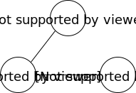
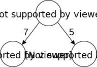
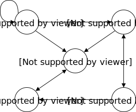
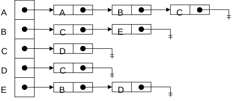
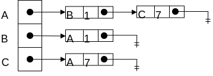
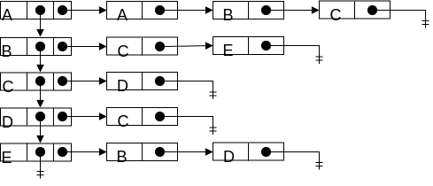
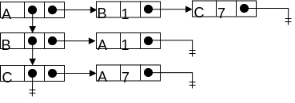
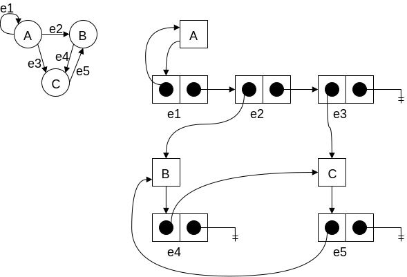

# Graphs and Their Representations

Graphs come in many flavors

* Direct vs undirected
* Weighted vs unweighted
* Cyclic vs acyclic

Undirected, unweighted, cyclic:

Undirected, unweighted, acyclic:

Directed, unweighted, acyclic:

Directed, unweighted, cyclic:

Undirected, weighted, cyclic:

Directed, weighted, acyclic:

Weights are internally relative

## Adjacency Matrix

|     | A   | B   | C   | D   | E   |
| --- | --- | --- | --- | --- | --- |
| A   | 1   | 1   | 1   | 0   | 0   |
| B   | 0   | 0   | 1   | 0   | 1   |
| C   | 0   | 0   | 0   | 1   | 0   |
| D   | 0   | 0   | 1   | 0   | 0   |
| E   | 0   | 1   | 0   | 1   | 0   |

Directed graph:

* Not guaranteed to by symmetric about the diagonal
* Therefore, we need to represent the whole thing

|     | A   | B   | C   |
| --- | --- | --- | --- |
| A   | 0   | 1   | 7   |
| B   | 1   | 0   | 0   |
| C   | 7   | 0   | 0   |

Undirected graph:

* Symmetric about the diagonal
* Therefore, only really need to represent the upper of lower triangle

Weighted graph:

* Weights in matrix

Unweighted graph:
* 1 used to denote presence of an edge, 0 used otherwise

## Adjacency List

Order is important (each index maps to a specific node)

## List-of-lists adjacency list representation

Order may be important (the Node ID is embedded in the chain of chains)

In both list representations, the nodes in each adjacency list need not be sorted (though they could be)

## An Object-Based Representation

There are many implementation strategies; one is to have 2 different classes:

* Node
    * Typically have "interesting" behaviors
    * Responsible for maintaining list of edges
* Edge
    * Typically don't have "interesting" behavior - often simple structs
    * An edge instance knows its
        * Weight (when graph is weighted)
        * Destination
        * They frequently also know their source

Aside: There is another object-based scheme that consists entirely of edge objects ["I connect q->P with a cost of 7"]

