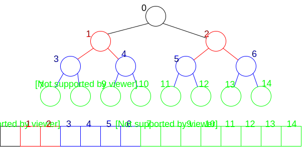

# Tree Representation

Trees are a special kind of graph. They can be represented by any of the graph representations.

When working with tree's whose Nodes have a fixed maximum number of children - e.g. a binary tree, each node may have 0, 1, or 2 children - another possibility is an array-based representation usually it is best reserved for cases when the tree is full or tends to be complete (or when we don't care about wasting memory representing a sparse, leggy-tree)

Positions in the tree map to positions in the array (and vice versa. If we know a node's position, we can reach it in O(1) time
