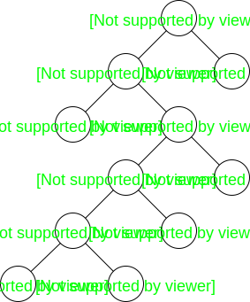
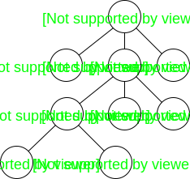
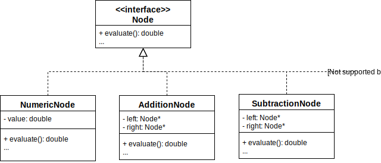
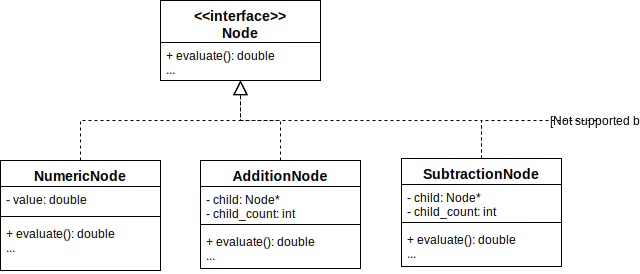

# Tree Representations of Arithmetic Expressions

Notice that the operators for infix, prefix, and postfix notations are binary, where as for sexps, the operators are n-aray. Both have a tree representation - e.g. here are two trees representing computationally equivalent expressions. Notice that the binary tree is taller and less compact.




## Object-oriented binary arithmetic expression tree implementation



Assuming the class hierarchy shown, we can implement evaluate():

```c++
double NumericNode::evaluate(){
 return value;
}
double AdditionNode::evaluate(){
  if( !has_two_children() )
    throw std::runtime_error("AddNode::evaluate(): lacks two children" );
  double left_value = left->evaluate;
  double right_value = right->evaluate;
  return left_value + right_value;
}
```

## Object Oriented n-ary arithmetic expression tree implementation



Assuming the class hierarchy shown, we can implement evaluate():

```c++
double NumericNode::evaluate(){
  return value;
}
double AdditionNode::evaluate(){
  if( !has_two_or_more_children() )
    throw std::runtime_error("AddNode::evaluate(): insufficient children" );
  double accumulated_value = child[0]->evaluate();
  for(int i = 1; i != child_count; ++i){
    accumulated_value += child[i]->evaluate();
  }
  return accumulated value;
}
```
