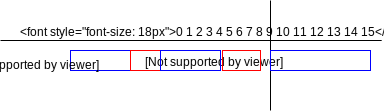

# RNGs: "Random" Number Generators

There are many occasions where one needs a random value or set of random values

## RNG Properties

Range

* The set of values it can produce
  
Probability Distribution

* Note: there are 2 broad categories, discrete and continuous. We'll be focusing our attention on discrete ones
* Uniform distribution: every value equally likely to occur
  * E.g. rolling a fair die
* Binomial distribution: the discrete analog of the Gaussian distribution (which is continuous - bell curve)
* Can create other distributions from uniform ones, including bigger uniform distributions
  * E.g. rolling dice and using them as digits

## Random vs Pseudorandom
  
True random sequence

* From a computation perspective, true randomness is hard to achieve
* Requires source of entropy
  * Prompting user to roll dice
  * Variations in keystroke timings
  * Mouse motion
  * Network events
  * Hardware RNG (e.g. thermal noise measurement on CPUs
* Slow
  
Pseudorandom Sequence

* In most applications, we can get away with faking randomness; in those cases we can just use pseudorandom numbers that are generated by an algorithm
* Have additional property
  * Period - the number of unique values you can generate (before they start repeating)
  
## Linear Congruential Generator (LCG)

Widely used: easy to implement, relatively fast


Random number depends on previous one

Rand<sub>n+1</sub> = ( alpha * Rand<sub>n</sub> + beta) mod gamma)

|                    | Constraints       | Values used by GNU's glibc |
| ------------------ | ----------------- | -------------------------- |
| Gamma              | 0 < gamma         | 232                        |
| Alpha = multiplier | 0 < alpha < gamma | 1103515245                 |
| Beta = increment   | 0 <= beta < gamma | 12345                      |

Rand<sub>0</sub> = the value used to prime iterated function is called the seed

The period of an LCG is at most gamma and depending on value of alpha may be much less

The moment a previously generated value is produced, the sequence is starting a new cycle

### LCG Caveats

LCGS should not be used when high-quality randomness is required

* E.g. Monte Carlo simulations (when accuracy is critical)
* Cryptography
* Etc.
  
## Aside: C++ support for C language's libc

All the standard C library functions (stdlib.h) are available in C++ by `include <cstdlib>`

* RAND_MAX
  * A platform/compiler dependent constant; guaranteed to be >=32,767
* Int rand(void)
  * Return a pseudorandom number using the LCG described above
  * Uniform distribution
  * Range [0, RAND_MAX)
* Void srand(unsigned int seed)
  * Seed is used to seed the RNG
  * When seed == 1, resets sequence
  * For a given seed, the same sequence of random numbers will be produced
  * Useful for testing (repeatable testing conditions)
  * Generally, a bad idea

Note: many systems seed rand() with the current time, so that each run will produce different results - this is not guaranteed

```c++
#include <cstdlib> //for rand() and srand()
#include <time>
//initialize the LCG with a time-based seed
srand ( (unsigned int) time(NULL) );
int r = rand();
```

FYI: Time returns the number of seconds since the epoch 00:00 hours Jan 1, 1970 UTC

Caution: Consider

```c++
//generate a random number in the range [0, n)
int r1 = rand() % n;
// generate a random number in the range [M, M+N)
int r1 = rand( rand() % N ) + M;
```

When high quality results are needed, don't do this: There is a subtle bias in the results. This can be especially problematic for small values of N.

For the sake of example, assume RAND_MAX = 15 and we want values between [0, 6)



0, 1, 2, 3 more likely than 4, 5

How to safely generate [0, N) and [M, M+N):


```c++
int nrand(int n){
    if(n <= 0 || n > RAND_MAX)
        throw domain_error("nrand(n): n is not a valid value");
    int const bucket_size = RAND_MAX / n //number of values in each bucket
    int r; //bucket number
    do
        r = rand() / bucket_size;
    while(r >= n);
    return r;
}
```

Usage:

```c++
//generate a random number in the range [0, n)
int r1 = nrand(N);
//generate a random number in the range [M, N+M)
int r2 = nrand(N)+M;
```

## Closing thoughts on LCGs

The randomness of the low-order bits is not particularly good

Q: since rand() can be biased when throwing away the high bits, and nrand() is based on rand(), does nrand() suffer from the same problem?

A: the use of buckets mitigates the poor randomness or rand()'s low order bits
