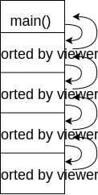
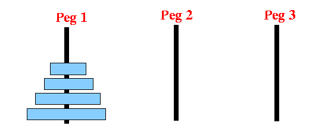
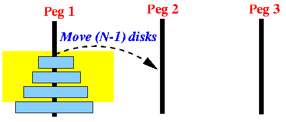
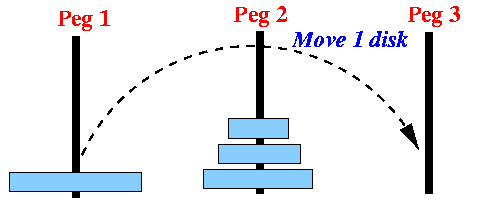
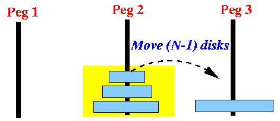
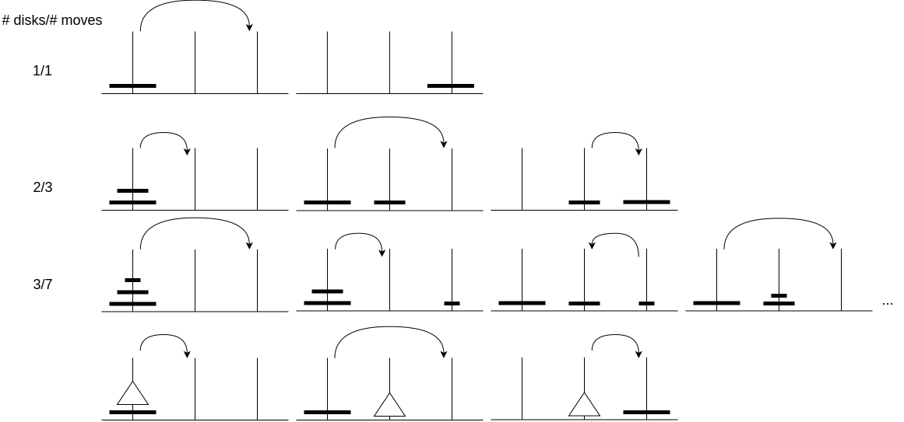
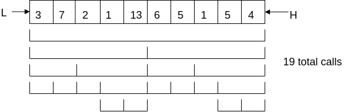

# Recursion

```c++
unsigned long int f(unsigned int){
    if(i == 0) return 0ul; //Base case
    return i + f(i-1); //Recursive step
}
```

f(3){ return-value = 3 + f(2); }  
f(2){ return-value = 2 + f(1); }  
f(1){ return-value = 1 + f(0); }  
f(0){ if(0 == 0) return-value = 0; }  

```
f(3) = 3 + f(2) = 6
            = 2 + f(1) = 3
                    = 1 + f(0) = 1
                            = 0
```

## Aside: Stack frame/activation record

Created when a function is called
Stores

* All the local variables
* The return address (where to resume execution when the function call returns)



## Towers of Hanoi
3 pegs and n disks, each with a different diameter. All the disks start on one peg, smaller on larger.

Goal: move all the disks to the destination peg (without breaking any rules)

Rules
* May only move one disk at a time, and it must be the top-most disk on its peg
* A larger disk can never be put on top of a smaller disk

Solution: algorithm is reduce and conquer

Starting configuration



In order to solve the problem, we need to get the largest to the destination peg. This requires it be the top-most disk on its peg. Since we can't put the largest disk on top of a smaller disk, the destination must not contain any smaller disks. The temporary peg must have all the other disks legally stacked on it

Therefore, the solution to towers of Hanoi is:







The solution to the smaller problem (how to move n-1 disks from the source to the temporary peg) has the same form as the original problem, therefore, using exactly the same technique

Aside: last time I mentioned that using an OO-approach to solving the problem - e.g. having Disk ad Peg classes - is overkill. However, in some contexts, e.g. an interactive game, where the player is manipulating disks - then it may be appropriate to use OOP

```c++
Void towers(int disk, int source, int destination, int temporary){
    Towers(n-1, source, temporary, destination);
    Move_disk(source, destination);
    Towers(n-1, temporary, destination, source);
}
```



Cost=1 for moving disk + 2 times cost of moving (n-1) disks

Proof by induction:
>Cost_1 = 1  
>Cost_2 = 1 + 2 * 1 = 3  
>…  
>Cost_n = 1 + 2 * cost_(n-1)  

Which gives us a tight asymptotic fit of (2^n)-1 moves are required


## Problem: Find the Max element in an array

Iterative:

```c++
template <typename T>
T max(T* left, T* end){ // end points past last element
    if(left == end)
        throw std::runtime_error("max() on array with no elements");
    T max = *left;
    while(left != end){
    if(*left > max)
        max = *left;
    ++left;
    }
    return max;
}
```

Recursive Solution (Divide-and-conquer):

```c++
template <typename T>
T max(T* left, T* right){
    if(left == right && right == nullptr)
        throw std::runtime_error("max() on array with no elements");
    return do_max(left, right);
}

template <typename T>
T do_max(T* left, T* right){
    if(left == right)
        return *left;
    T* middle = left + ((right - left) / 2);
    T u = do_max(left, middle);
    T v = do_max(middle+1, right);
    return(u>v) ? u : v;
}
```



This is a stupid way of solving this specific problem, but it does illustrate 2 important techniques

* The idea of using pointers to denote subranges in an array, and
* The idea of dividing a problem into halves (thirds, fourths, etc.)

These are very powerful techniques, often used in algorithm design

## Why even use recursive algorithms?

There is a theorem in CS that anything which can be written recursively can be written iteratively and vice versa

Generally, one doesn't choose recursion for its computational efficiency. Each recursive call requires a new stack frame and all the overhead of making a function call*. The cost for each call may be miniscule, but if one does it a lot, the costs can add up.

*for a tail recursive function, some languages and/or compilers may generate code that is as efficient as a loop

The reason for recursion is that there are some problems for which a recursive solution is much easier (quicker) to write and more elegant (understandability is dramatically improved)

Aside: converting a recursive algorithm to an iterative algorithm usually, but not always, requires that a stack be used to remember values that would be preserved in the stack-frame/activation record of a recursive solution

Note: because recursion stores data in activation records, it is possible to run out of (call) stack space => crashed program

## Evaluate a function in reverse order on a SLL

Iterative Solution (centralized control):

```c++
class SLL{
    struct Node {
        Data data;
        Node *next;
    };
    Node* head;
    public
    void eval(void f(Data)){
        size_t i = size();
        while( i > 0)
        f(item_at(--i));
    }
};
```

```c++
Recursive Solution (decentralized control)
class SLL{
    struct Node {
        Data data;
        Node *next;
        void eval(void f(Data)){
            if(next != nullptr)
                next->eval(f);
            f(data);
        }
    };
    Node* head;
    public
    void eval(void f(Data)){
        if(head != nullptr)
        head->eval(f)
    }
};
```

Runtime Performance?

Iterative:

f(4)  0->1->2->3->4  
f(3)  0->1->2->3  
f(2)  0->1->2  
f(1)  0->1  
f(0)  0  

Traverses the list n times; traversal cost is O(n), therefore O(n2) overall

Recursive

```c++
eval() on 0
    eval() on 1
        eval() on 2
            eval() on 3
                eval() on 4
                    f(4)
                f(3)
            f(2)
        f(1)
    f(0)
```

Traverses list 1 time; traversal cost is O(n), therefore O(n) overall 

Q: Could we write an O(n) iterative solution?

A: Yes, if we used a stack to remember the nodes we visited (they'd get popped off in reverse order)
