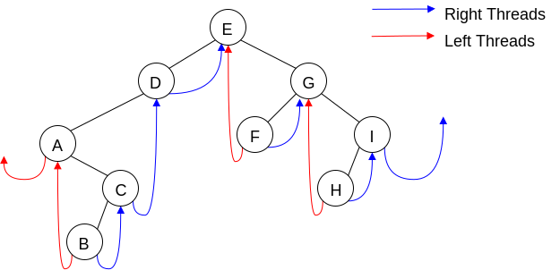

# Binary Search Tree

Binary Search Tree - everything to the left of a node comes before that node, everything to the right of a node comes after that node

| Recursive Preorder                                                          | Recursive Inorder         | Recursive Postorder       |
| --------------------------------------------------------------------------- | ------------------------- | ------------------------- |
| Process self (SELF) <br> Left->preorder (LEFT) <br> Right->preorder (RIGHT) | LEFT <br> SELF <br> RIGHT | LEFT <br> RIGHT <br> SELF |


Inorder prints BST in order; processes node the 2nd time we encounter it  
Preorder - prints on way down; processes node the 1st time we encounter it  
Postorder - prints on way up; processes node the 3rd time we encounter it

## Binary Tree Traversal


### Preorder, centralized recursive

```c++
void preorder( void f(T&) ){
    do_preorder(root, f);
}
private:
void do_preorder( Node <T>* curr, void f(T&) ){
    if(curr){
        f(curr->data);
        do_preorder(curr->left, f);
        do_preorder(curr->right, f);
    }
}
```

### Preorder, decentralized recursive

```c++
In bintree class:
void preorder( void f(T&) ){
    if(root) root->preorder(f);
}
In node class:
void preorder( void f(T&) ){
    f(data);
    if(left) left->preorder(f);
    if(right) right->preorder(f);
}
```


Stack Trace:  
0 - Tree  
1 - D  
2 - B  
3 - A  
4 - A's left  
pop A's left  
5 - A's right  
pop A's right  
pop A  
6 - C  
7 - C's left  
pop C's left  
8 - C's right  
pop C  
pop B  
9 - F

### Preorder, iterative stack-based

```c++
void preorder( void f(T&) ){
    stack<Node<T>*> stack;
    //prime the stack
    stack.push(root);
    //traverse
    while(!stack.empty()){
        Node<T>* curr = stack.pop();
        f(curr->data);
        //order of kids is important! LIFO!!
        if(curr->right) stack.push(curr->right);
        if(curr->left) stack.push(curr->left);
    }
}
```

Stack Trace:  
D  
pop D  
F  
B  
pop B
C  
A  
pop A  
pop C  
pop F  
G  
E  
pop E  
pop G  

Because the traversal of trees requires us to return to a previous context, removing the recursion requires us to use a mechanism for keeping track of what still needs to be done => ADT stack

Based on the call structure, we can remove the recursion using an ADT stack

Note: is some cases, recursion can be easily removed without resorting to a stack - later, we'll discuss 3 different general techniques to accomplish that

### Inorder, centralized recursive

```c++
void preorder( void f(T&) ){
    do_preorder(root, f);
}
private:
    void do_preorder( Node <T>* curr, void f(T&) ){
        if(curr){
            do_preorder(curr->left, f);
            f(curr->data);
            do_preorder(curr->right, f);
        }
    }
```

### Inorder, iterative stack-based

Idea:

* Prime the stack
* Start at root
* Go down leftmost branch, push all left children


Stack:  
F  
E  
A  
pop A  
D  
C  
B  

Take 1:

```c++
Curr = root;
While not done
    If curr
        Push curr
        Curr = its left child
    Else
        If stack is empty
            Break out of loop
        Else
            Curr = pop
            Process curr
            Curr = its right child
```

Take 2:

```c++
Curr = root
While(curr || stack not empty)
    If curr
        Push curr
        Curr = its left child
    Else
        Curr = pop
        Process curr
        Curr = its right child
```

Take 3:

* 1968: Donald Knuth posed the problem: is it possible to design a stack-free, tag free, non-recursive traversal of a binary tree unmolested in the end?
* 1979: Joseph Morris devised a quite elegant solution
* 2012: Meteti and Manghirmalani demonstrated that Morris' solution works because it implicitly builds a stack in the tree. None-the-less, I think Morris' solution is a valid solution to Knuth's problem (b/c it doesn't rely on an explicit stack)

Threaded binary tree:



Morris' solution relies on a partially threaded binary tree

* A right threaded tree - right child nullptrs are replaced with links to this node's inorder successor
* A left threaded tree - left child nullptrs are replaced with links to this node's inorder predecessor

If a tree has both left and right threads, it is full threaded

Morris' Solution:

Will thread the tree - and unthread it, leaving the original tree structure when its done

```c++
while(anchor)
    if anchor does not have a left child
        process anchor's data
        anchor  = anchor's right child
    else
        find anchor's IOP (inorder predecessor)
        if the IOP is threaded to anchor
            unthread it
            anchor = anchor's right child
        else
            process anchor's data
            thread IOP's right to anchor
            anchor = anchor's left child
```

### Inorder, iterative, stack-free

```c++
while(anchor)
    if anchor does not have a left child
    process anchor's data
    anchor  = anchor's right child
else
    find anchor's IOP (inorder predecessor)
    if the IOP is threaded to anchor
        process anchor's data
        unthread it
        anchor = anchor's right child
    else
        thread IOP's right to anchor
        anchor = anchor's left child
```

### Postorder, iterative, stack free (Morris-like sol)

Much more complicated

Uses of a dummy node, so we can treat all nodes uniformly

### Postorder, iterative, stack-based

```c++
if there is not a root return
create a stack
push the root
prev = nullptr
while the stack is not empty
    curr = peek at stack
    if (there is no prev OR prev's left is curr OR prev's right is curr)
        then //we are traversing downward
            if curr has left
                push curr's right child
            else curr has right child
                push curr's right child
    else if curr's left is the same as prev
        then //coming back up from left side
            if curr has right
                push curr's right
    else //coming back up from the right side
        evaluate curr's data
        pop stack
```

  • Level-order traversal


This is not a traversal that can be easily implemented using recursion, the technique used, therefore, is iterative. It's almost identical to a preorder (stack-based) iterative traversal

```c++
queue<Node<T>*> q;
//prime the queue
q.enqueue(root)
//traverse
while(!q.empty()){
    node<T> *curr = q.dequeue();
    f(curr->data);
    //order of kids is important! FIFO!!
    if(curr->left) q.enqueue(curr->left);
    if(curr->right) q.enqueue(curr->right);
}
```
