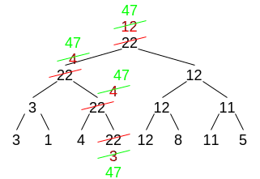

# Tournament Trees

These simulate an odd kind of tournament. Each contestant has a single score that is used throughout the entire tournament (their score never changes). The tournament is a pair-wise, single elimination.

In this example, let's assume that the winner is the one with the maximum score (in some contexts, it may be the minimum).


## Implementation Strategies

The complexity for constructing a TT is Θ(N)

### Node-Based

Given an array of scores, construct a TT. Assume winner tree (max score wins)

```c++
node *winner(int *scores_begin, int *scores_end){
    int *middle = ( (scores_end-scores_begin) / 2 ) + scores_begin;
    node *n = new Node(*middle);
    if(scores_begin == scores_end)
        return n;
    n->left = winner(scores_begin, scores_middle);
    n->right = winner(scores_middle, scores_end);
    n->data = n->left->data < n->right->data ? N->right->data : n->left->data;
    return n;
}
```

(divide and conquer)

### Packed Array


Note in some cases it may be convenient to leave slot 0 empty (i.e. the root in slot 1) - a perfect TT would then use an array of size 2n rather than an array of size (2n-1)

It may be desirable to represent the winners, not their scores

## Updating a winner tree

How to update a TT when a score changes



Complexity O(lg n)

## Using TT for sorting

Aside: sorting

* Internal sorting algorithms: all the data are memory resident
* External sorting algorithms: only a portion of the data are memory resident at any given time -> sort parts at a time

### Internal sorting using a TT

Min winner tree => non-decreasing sort  
Max winner tree => non-increasing sort

Algorithm for non-decreasing sort

```c++
Initialize the TT
While ∃ element != ∞
    Output the winner's score
    Change winner's score to infinity
```

Analysis:

* Building the tree Θ(n)
* Loops for each of the n elements => total loop complexity O(n lg n)
* Output O(1)
* Updating TT O(lg n)
* Θ(n + n lg n) => O(n lg n)

### External sorting with TT

Sometimes we want to sort more data than we can fit into memory at the same time

This is a two-phase sort

Phase 1: sort

* Partition the n items into k sets, such that each set is small enough to fit into memory
* Sort each set using an internal sort [each set is often referred to as a run]
* Merge the k sets

Phase 2: K-way merge

* Assume we're using a min winner tree (non-decreasing sort)
* Initialize the tree with the minimum values from each of the k sets

```c++
While ∃ element != ∞
    Output winner's score
    Replace the winner's source with either
        Next unmerged value from the winner's run, or
        if all the values have been used from that run ∞
```


Analysis of K-way merge:

* Building the tree Θ(k)
* Looping through each of the n elements (n = the combined size of the k sets) => total loop complexity O(n lg k)
* Each replacement O(lg k)
* For a total time of Θ(k + n lg k)

## Loser Trees

Motivation - make it cheaper to replace the tournament winner (i.e. updating the tree changes the winner); have the same cost as a winner tree when replacing non-winner


Winner tree case:

Replace winner: must rerun all the contests from the old winner to the root O(lg n)

Replace nonwinner: minimum number of contests to rerun is 1, max is lgn

Loser tree case:

Replace winner: must rerun all the contests from the old winner to the root O(lgn)

* Fast to find whoever we are competing against at each level
* Parent of i => parent id of loser of the round in old tree
* Score[replaced_player] compared to score[parent of replaced player] <= first round
* Parent node tells you who you will compete against
* Stores indices of losers for faster lookup
* This is slightly more efficient than having to compute the competitor in a winner tree

Replace nonwinner:

* Winner tree is better

Note: each of the contestants is represented exactly once in a loser tree

Moral: a loser tree is applicable when the only player whose value will be updated is the winner of the overall tournament. If the nonwinners can be updated, use a winner tree

Abstract Data Type Tournament Trees - 2 Data structures: nodes and packed-array
