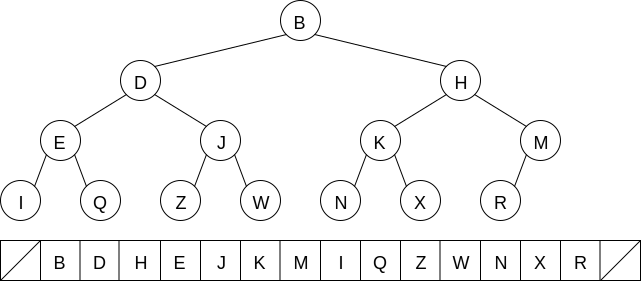
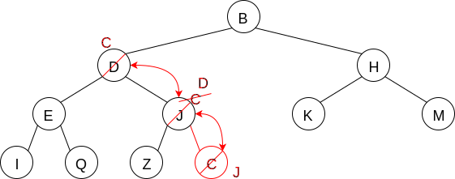
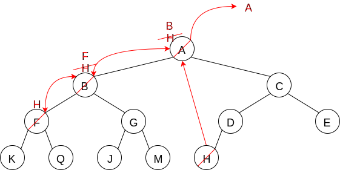
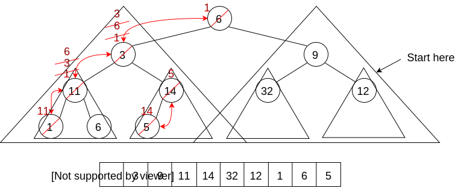

# Heaps and Heap-Ordered Trees

The heap - refers to the pool of memory reserved for your program from which it dynamically allocates memory

Heap-ordered tree - a complete binary tree in which each node's priority is higher or equal-to the priorities of its children; no node in a heap-ordered tree has a higher priority than the root

A heap [or heaps, if multiples] - a heap-ordered tree that uses an array-based representation

Usually slot 0 is unused and slot 1 represents the root

* Min-heaps - the node with the highest priority has the smallest value
* Max-heaps - the node with the highest priority has the largest value

## Example

Consider: K R M Z Q D J B E W X N I H

* Priority: closer to the alphabet's beginning, the higher the priority

There are many possible heap-ordered trees for the set of data



The convention with languages that start indexing arrays from 0, is to put the root in slot 1 (makes the math slightly simpler


| Tree rooted at: | 1   | 2   | 3   | 4   | 5   | 6   | 7   |
| --------------- | --- | --- | --- | --- | --- | --- | --- |
| Left child:     | 2   | 4   | 6   | 8   | 10  | 12  | 14  |
| Right child:    | 3   | 5   | 7   | 9   | 11  | 13  | 15  |

Pattern

* Parent of node i = i/2
* Left child of node i = 2i
* Right child of node i = 2i + 1

## Insertion into a heap-ordered tree



We want to insert (into the heap; so we insert it in the first available slot (J's right child). Alas, it's no longer a heap-ordered tree, we need to fix it. Starting at the inserted node:

```c++
Compare with parent
    If child has higher priority, swap parent and child
    Else done
Repeat until at root
```

Analysis:

* Best case: Θ(1) [no swaps needed]
* Worst case: Θ(lgn) [swaps all the way to the root]
* Average case: O(lgn)

Body of an insert operation (for a heap)

```c++
int n = next free position in tree;
int I = n;
heap[i] = item;
while( (i>1) && (heap[i/2] > heap[i]) )
    swap(i/2, i)
    i = i/2
```

Delete root (highest priority value)



Incorrect process

```c++
Moving higher of two children up
```

Correct process

```c++
1. Remove the root's value
2. Replace root's value with the right-most value on the lowest level
3. i = root
4. While (i's value has a lower priority than the highest of its children's priority)
    i. Swap the value of i and the child with the highest priority
    ii. i = child
```

"Heapify-ing an array"



Goal: given an array representing a complete tree, turn it into a heap

We could accomplish this by creating an empty array to represent the heap, and then do n heap insertions (one for each value in the source array). The complexity for this is O(nlgn) and it uses an extra array. We can do this in Θ(n) and time using just the source array (its contents will be heapified when we are done)

```c++
Beginning with the last element that has a child
i = n/2
top_down_fix(i)
while(i != 0)
    top_down_fix(i)
    --i;
```
