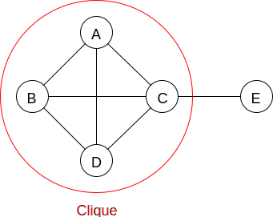

# Graphs

## More terminology

A **graph** is a set of vertices (nodes) and edges (arcs)

An **edge** connects a pair of vertices. **Parallel edges** connect the same pair of vertices. A **(self)loop** is an edge that connects the vertex to itself.

A **multigraph** may contain parallel edges

A **simple graph** cannot contain any parallel edges nor loop

A **pseudograph** may contain parallel edges and/or loops

A **path** is a sequence of edges such that each successive edge's starting vertex is the previous edge's ending vertex

A **simple path** requires all vertices and edges to be distinct

A **cycle** is a path whose first index is its last index

When comparing two (or more) paths

* **Disjoint paths** have no vertices in common (except, perhaps for their endpoints)
* **Vertex disjoint** paths have no vertices in common (no exception)
* **Edge disjoint** paths have no edges in common

A **Connected graph** is one such that ∀ i != j ∃ Vi path Vj. It has one or more spanning trees.

An **unconnected graph** consists of a set of unconnected components. It has one or more spanning forests.

A **complete graph** is one in which there is an edge connecting each pair of vertices

The **union** of two graphs is the union of their vertices and edges. The union of a graph and its complement is a complete graph.

A **clique** is a complete subgraph

The **density** of a graph is the average degree of its vertices (2E/V for undirected graphs). A dense graph is one where 2E/V is proportional to V (complete is dense). A sparse graph is one who complement is dense.

Note: density is an important consideration when choosing graph representation and algorithms

A **bipartite graph** is one in which the vertices can be divided into two sets and every edge connects a vertex in each set (hence, there are no edges connecting vertices in the same set). Their subgraphs (containing at least two vertices) are also bipartite

Edges can be directed (some people call them arcs V->W

A **digraph** (short for directed graph) is one containing directed edges

A **DAG (Directed, Acyclic Graph)** is a directed graph that has no cycles

Note: a DAG's underlying simple graph (i.e. removed the directionality from the edges) may have cycles

The **degree** of a vertex is the number of incident edges

| Vertex | Degree |
| ------ | ------ |
| A      | 2      |
| B      | 3      |
| C      | 3      |
| D      | 2      |

| Vertex | In degree | Out degree |
| ------ | --------- | ---------- |
| A      | 2         | 0          |
| B      | 0         | 3          |
| C      | 2         | 1          |
| D      | 1         | 1          |

Note that the degree of a node in a simple graph is equal to the sum of the in- and out- degrees of the digraph from which it was extract

* Sparse/dense - how well connected is the graph
  * Sparse -> |V| ~ |E|
  * Dense -> |E| ~ |V2-V|

Edges can be weighted => weighted graph

Some people call weighted digraphs **networks**
