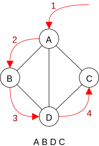
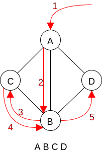
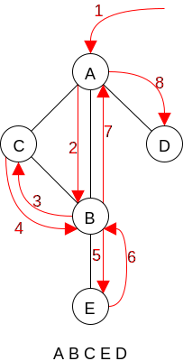
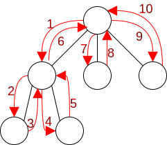
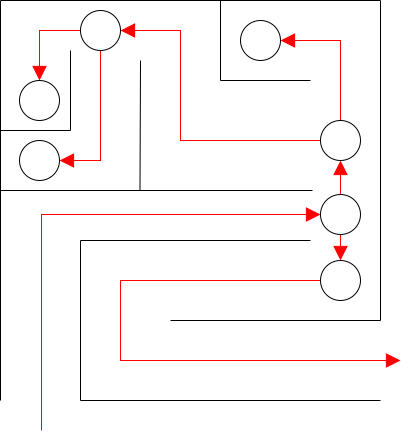

# Graph Traversal

## Depth First

Idea: take a path and keep going until

* We are done (i.e. visited each vertex)
* Reach a dead end, in which case we back up to the most recently untaken branch and continue from there

In some cases, we must start from a specific node





A depth first traversal on a graph is analogous to a preorder tree traversal



### Recursive DFS implementation

```c++
DFS(n)
    if n has been visited
        return
    mark n as visited
    //do something while we are here
    for each child C of n
        DFS(c)
```

### Iterative DFS implementation

```c++
DFS(n)
    s is a stack of nodes
    push n
    while stack is not empty
        curr = pop the stack
        if the node has not been visited
            mark curr as visited
            //do something while we are here
            for each child C of curr
                push C
```

Observation

A maze can be represented as a graph - each decision point (and dead end) represented by a vertex, with edges leading to the next decision point (or exit)

A common technique for solving mazes is to implement DFS



## Breadth First

Idea: starting at some node n

* Visit all the nodes adjacent to n (distance of one hop away from n here distance != weight)
* Visit all the unvisited nodes adjacent to the adjacent nodes [distance of 2 hops away]
* Usw.


Analogous to a level-order traversal

### BFS Implementation

```c++
BFS(n)
    Q is a queue of nodes
    Enqueue n
    While the queue is not empty
        Curr = dequeue
        If curr not visited
            Mark curr as visited
            //do something while we are here
            For each child c of curr
                Enqueue c
```
