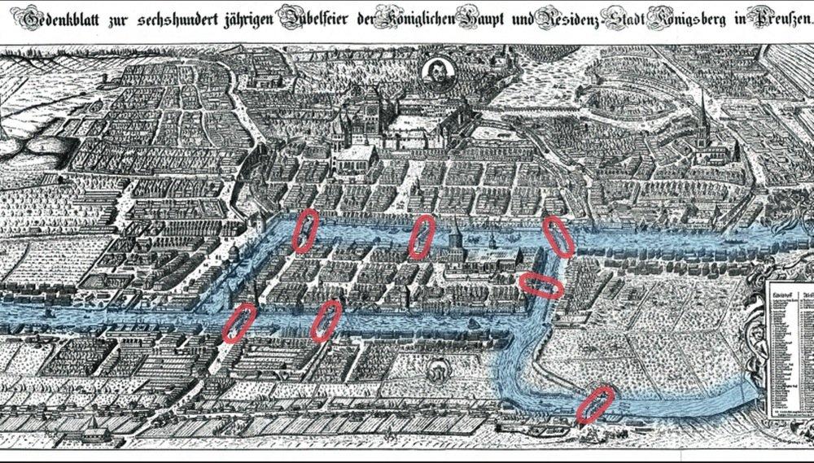

# More Graph Terminology

The existence of a simple path means there is a way to get from v to w such that every vertex along the path is unique (acyclic)

How could one test for the existence of a simple path? [not the same as asking for the simple path]

A: use a DFS starting at v, if we ever encounter w, stop and return true; otherwise, return false. This works whether the graph is undirected or directed

A **Hamilton path** is a simple path v->w such that every vertex is represented in the path

A **Hamilton tour** is a Hamilton path v->v [start and end are the same => giant cycle]

The book contains a recursive algorithm to determine if a graph contains a Hamilton path: its worst-case runtime is ~O(V!)

Aside an O(V!) algorithm is essentially unusable except for very small values

| V   | Time to solve (assuming 15 nodes/sec) |
| --- | ------------------------------------- |
| 19  | 1 day                                 |
| 21  | >1 year                               |
| 23  | >6 centuries                          |

| V   | Time to solve (Assuming 3 million nodes/sec) |
| --- | -------------------------------------------- |
| 23  | 1 day                                        |
| 25  | >1 year                                      |
| 27  | >6 centuries                                 |

This is an open research problem: no one has found a solution that can handle medium to large graphs in a reasonable amount of time

An **Euler path** is a simple path v->w such that every edge in the graph is represented in the path [vertices may be visited multiple times]

An **Euler tour** is an Euler path v->v [start and end are the same => giant cycle]

## The Konigsberg Bridge Problem

Euler asked the question: can we take a walk such that we cross each bridge exactly once? Nope

A graph contains an Euler tour iff it is

* connected and
* All its vertices have an even degree

A graph contains an Euler path iff it is

* Connected and
* Exactly two vertices have an odd degree

If a graph contains an Euler path, we can convert it to an Euler tour by adding an edge between the start and stop vertices

