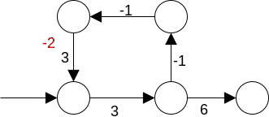

# Finding Shortest Paths

A shortest path v->w in a network is a directed, simple path from v to w such that no other simple path between those two vertices has a lower total cost/weight

## High-level overview of shortest-path algorithms

There are different categories of algorithms based upon what we are trying to find

**Source-sink shortest path** - goal: find a shortest path v->w; source - start vertex, sink - end vertex

**Single source shortest path** - goal: find shortest paths from v to each of the other vertices

* Produces SPT => shortest path tree
* We'll assume the shortest path between 2 unconnected vertices has a cost/weight of infinity

**All-pairs shortest path** - goal: find a shortest path for every pair of vertices

## Dijkstra's Algorithm

Find a SPT (shortest path tree) in a graph rooted at a specified vertex

Overview

```c++
While there exists an unsolved (has not been added to set yet) vertex u with a finite cost (to reach it)
    Choose an unsolved vertex with a minimal cost c
    Mark it solved
    For each vertex v adjacent to it
        If the cost s=>u=>v is less than the previously computed cost s=>v
            Update the table with a new minimum cost s=>v
```


| Step | Solve | Unsolved | A   | B       | C        | D       | E       | F       | G       | H       |
| ---- | ----- | -------- | --- | ------- | -------- | ------- | ------- | ------- | ------- | ------- |
| 0    | A     | BCDEFGH  | -   | B/5     | C/15     | ∞       | E/6     | ∞       | ∞       | ∞       |
| 1    | B     | CDEFGH   | -   | **B/5** | B/14     | B/9     | E/6     | ∞       | ∞       | ∞       |
| 2    | E     | CD FGH   | -   | "       | B/14     | E/8     | **E/6** | ∞       | ∞       | E/7     |
| 3    | H     | CD FG    | -   | "       | B/14     | E/8     | "       | H/11    | H/9     | **E/7** |
| 4    | D     | C  FG    | -   | "       | B/14     | **E/8** | "       | D/9     | H/9     | "       |
| 5    | F     | C   G    | -   | "       | B/14     | "       | "       | **D/9** | H/9     | "       |
| 6    | G     | C        | -   | "       | G/12     | "       | "       | "       | **H/9** | "       |
| 7    | C     | _______  | -   | "       | **G/12** | "       | "       | "       | "       | "       |


Doesn't work when there are negative costs

Observation

Dijkstra's algorithm is a greedy algorithm - every time there is a choice, it takes a "best" one of the choices available. Because it is greedy, the graph cannot violate an implied assumption: there is no path better than the "best" one previously discovered. Thus, negative weights are disallowed because they could allow part of a graph whose initial costs are higher than the "best" that was chosen to actually be better

### Implementation Strategies

Use an array (or pair of arrays: one for the node to go to, one for the cost) for the table

Use an array to keep track of which nodes have been solved (e.g. boolean array)

* On each cycle of the algorithm search the unsolved array for one that has the "best" path => O(V<sup>2</sup>)

If we use a min heap (better == cheaper) ordered by the known minimum cost path to that node => O(E lgV)

Dijkstra's can be used to solve the all-pairs shortest path problem

For each v in the network

`SPT[v] = dijkstras(v, g)`

i.e. run dijkstra's with each vertex as the source

## Floyd-Warshall's Algorithm

Solves the all pairs shortest path problem

O(V<sup>3</sup>)

Very easy to implement

When the network is dense, it'll outperform solving the same problem using Dijkstra's algorithm

It's not a greedy algorithm, and will thus handle negative cost edges, IFF there are no negative cycles



Cost of going through cycle = 3 + -1 + -1 + 3 = 4  
New cost of going through cycle = 3 + -1 + -1 + -2 = -1 so you should stay in cycle forever

Typically, negative cycles are disallowed

Idea:

For each step, we want to compare the shortest cost path i->j. If cost of going through k is less, then it becomes new min

```c++
min i->j = min(i-->j, i-->k-->j)
where i-->k-->j is min(i, k) + min (k, j)

shortest(i, j, k) = min
                    (
                        edge(i, j), k == 0
                        min
                        (
                            shortest (i, j, k-1)
                            shortest(i, j, k-1) + shortest(k, j, k-1)
                        ), k > 0
                    )
all nodes <= k are eligible to be considered
```

Pseudocode

```c++
for each intermediate vertex k
    for each starting vertex i
        for each destination vertex j
            possible_path_cost := cost i->k + cost k->j
            if possible_path_cost < cost i->j
                cost i->j := possible_path_cost
                intermediate_destination i->j := k
```

There are two related things we can compute

How much does shortest path cost?

What vertices are in each of the shortest paths found?


Path

| From\To | A   | B   | C   | D   | E   |
| ------- | --- | --- | --- | --- | --- |
| A       | 0   | 1   | 5   | 1   | ∞   |
| B       | 1   | 0   | 7   | 3   | ∞   |
| C       | 5   | 7   | 0   | ∞   | ∞   |
| D       | ∞   | 3   | ∞   | 0   | 1   |
| E       | 1   | ∞   | 1   | ∞   | 0   |

Edge

| From\To | A   | B   | C   | D   | E   |
| ------- | --- | --- | --- | --- | --- |
| A       | -   | -   | -   | -   | -   |
| B       | -   | -   | -   | -   | -   |
| C       | -   | -   | -   | -   | -   |
| D       | -   | -   | -   | -   | -   |
| E       | -   | -   | -   | -   | -   |

K==A intermediate stop

Will it be shorter to go from A to A by going through A? no  
…  
Will it be shorter to go from B to C by going through A?  
B->A = 1 A->C=5 1+5 = 6 < 7 Yes  
Etc.

Path

| From\To | A   | B     | C     | D     | E   |
| ------- | --- | ----- | ----- | ----- | --- |
| A       | 0   | 1     | 5     | 1     | ∞   |
| B       | 1   | 0     | **6** | **2** | ∞   |
| C       | 5   | **6** | 0     | **6** | ∞   |
| D       | ∞   | 3     | ∞     | 0     | 1   |
| E       | 1   | **2** | 1     | **2** | 0   |


Edge

| From\To | A   | B     | C     | D     | E   |
| ------- | --- | ----- | ----- | ----- | --- |
| A       | -   | -     | -     | -     | -   |
| B       | -   | -     | **A** | **A** | -   |
| C       | -   | **A** | -     | **A** | -   |
| D       | -   | -     | -     | -     | -   |
| E       | -   | **A** | -     | **A** | -   |


K==B intermediate stop

Path

| From\To | A     | B   | C     | D   | E   |
| ------- | ----- | --- | ----- | --- | --- |
| A       | 0     | 1   | 5     | 1   | ∞   |
| B       | 1     | 0   | 6     | 2   | ∞   |
| C       | 5     | 6   | 0     | 6   | ∞   |
| D       | **4** | 3   | **9** | 0   | 1   |
| E       | 1     | 2   | 1     | 2   | 0   |


Edge

| From\To | A     | B   | C     | D   | E   |
| ------- | ----- | --- | ----- | --- | --- |
| A       | -     | -   | -     | -   | -   |
| B       | -     | -   | A     | A   | -   |
| C       | -     | A   | -     | A   | -   |
| D       | **B** | -   | **B** | -   | -   |
| E       | -     | A   | -     | A   | -   |

K==C intermediate stop

No changes

K==D intermediate stop

Path

| From\To | A   | B   | C   | D   | E     |
| ------- | --- | --- | --- | --- | ----- |
| A       | 0   | 1   | 5   | 1   | **2** |
| B       | 1   | 0   | 6   | 2   | **3** |
| C       | 5   | 6   | 0   | 6   | **7** |
| D       | 4   | 3   | 9   | 0   | 1     |
| E       | 1   | 2   | 1   | 2   | 0     |

Edge

| From\To | A   | B   | C   | D   | E     |
| ------- | --- | --- | --- | --- | ----- |
| A       | -   | -   | -   | -   | **D** |
| B       | -   | -   | A   | A   | **D** |
| C       | -   | A   | -   | A   | **D** |
| D       | B   | -   | B   | -   | -     |
| E       | -   | A   | -   | A   | -     |

K==E intermediate stop

Path

| From\To | A     | B   | C     | D   | E   |
| ------- | ----- | --- | ----- | --- | --- |
| A       | 0     | 1   | **3** | 1   | 2   |
| B       | 1     | 0   | **4** | 2   | 3   |
| C       | 5     | 6   | 0     | 6   | 7   |
| D       | **2** | 3   | **2** | 0   | 1   |
| E       | 1     | 2   | 1     | 2   | 0   |

Edge

| From\To | A     | B   | C     | D   | E   |
| ------- | ----- | --- | ----- | --- | --- |
| A       | -     | -   | **E** | -   | D   |
| B       | -     | -   | **E** | A   | D   |
| C       | -     | A   | -     | A   | D   |
| D       | **E** | -   | **E** | -   | -   |
| E       | -     | A   | -     | A   | -   |

Extracting the minimal cost paths encoded in next array

```c++
If path[i][j] == ∞
    Output "no path"
Intermediate = next[i][j]
If intermediate == null //path goes "directly" i->j
    Output nothing
Else
    Extract path i->intermediate
    Output intermediate
    Extract path intermediate->j
```

Is there a path i->j of n hops ∀ i and j?

We could use Dijkstra's or Floyd-Warshall's, but there is a faster technique which does not determine the cost of the paths, nor does it tell us what vertices are in the paths

Given an adjacency matrix A, such that
* If ∃ edge i->j then A[i][j] = 1 (presence of an edge, not cost/weight)
* Else A[i][j] = 0

Compute A<sup>n</sup> => each non-zero entry indicates a path i->j that is n hops long

Note: the path may contain cycles
