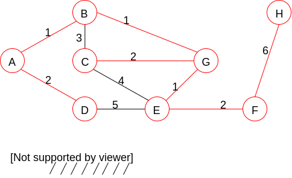
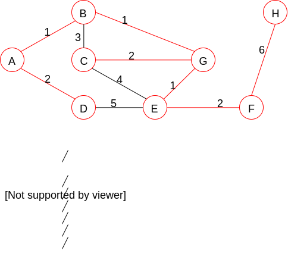
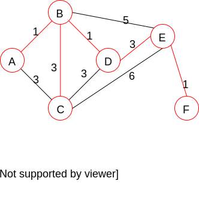

# Spanning Trees

A spanning tree for a graph G is a tree that contains every vertex in G

Note: the algorithms we'll be discussing assume G is weighted and undirected

## MST: Minimum Spanning Tree

Would be better named minimal spanning tree because there may be more than one for a given graph

MST = a tree connecting all the vertices in a weighted graph such that the sum of the tree's edge weights is minimal

Recall

* A tree with V vertices has exactly V-1 edges
* A fully connected graph has V(V-1) edges (roughly V<sup>2</sup>)
  * We'll assume that is a good approximation for dense graphs even if they aren't fully connected
  * An O(ElgE) algorithm may not be worse than an O(ElgV) algorithm, because at worst E == V2, therefore lgE = lgV2, thus lgE <= 2lgV

### Prim's Algorithm

Idea: start at any vertex; build the tree by adding one vertex at a time from the set of fringe vertices (i.e. vertices that are adjacent to, but not yet part of the tree), such that edge e Ti->Fj is minimal

```c++
T denotes a vertex in the tree
F denotes a vertex in the fringe set

U = {all vertices in the graph}
S = {} //vertices added to MST
E = {} //edges in the MST
Initialization:
    Remove random vertex from U
    Add u to S
    While U is not empty
        *Find a vertex s in S and vertex u in U such that edge e s->u is minimal
        Remove u from U
        Add u to S
        Add e to E
```



Performance dependant on *

Naïve implementation for *

```c++
For each vertex u in U
    For each edge e incident to u and a vertex in s
        If e < minimal_edge
            minimal_edge = e
```

This step would be O(EV) and thus overall performance would be O(EV<sup>2</sup>)

We can substantially improve the performance by using a heap of incident edges ordered by weight

* Binary heap => overall performance in O(ElgV)
* Fibonacci heap => when E dominates V, then better than O(ElgV)
  * When the graph is very dense (E >= ElgV) the complexity is linear

### Kruskal's Algorithm

Idea: start with a forest of |V| trees (one vertex in each tree); then repeatedly merge the two closest trees until only one is left

I like to think of this as the Highlander Algorithm, because "there can be only one!"

```c++
Trees = {all the vertices in the graph}
Edges = {all the graph's edges}
While |trees| > 1
    Remove a minimal edge e from edges
    If e connects 2 previously unconnected tree t1 & t2 (if the trees are already joined, adding this edge would produce a cycle)
        Remove t1 and t2 from trees
        Join them t = t1-e-t2
        Insert t into trees
```



Performance

When implemented intelligently, O(ElgE) == O(ElgV). We get this by using a heap ordered by edge weights

### Boruvka's Algorithm

Is similar to Kruskal's except in each cycle we'll be joining multiple trees

When combined with Prim's, we can create a variant that is quite efficient when run on parallel computers

This course tends to focus on sequential algorithms, but to take full advantage of multiple CPUs and distributed systems, parallel algorithms are needed


