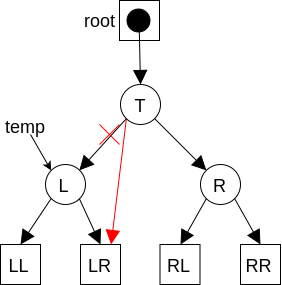
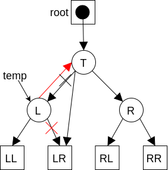
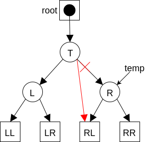
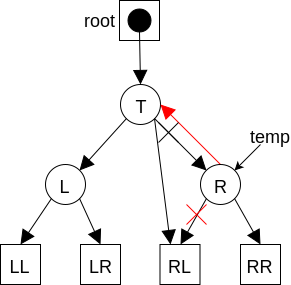

# Search Trees

For our examples we'll work with a BST (Binary Search Tree)


## Unbalanced binary search trees

Insert

```c++
node = root
while (! Node is an empty tree)
    if key < node's key
        node = node's left child
    if key > node's key
        node = node's right child
add node as child for key-value
```

Aside: when designing a BST, we need to decide if duplicates are allowed, and if so how they are handled (e.g. insert as left child, insert as right child, increment instance count)

Search

```c++
node = root
while(!node is an empty tree)
    if node's key == key return node's value
    else if node's key < key, node == node's left child
    else node == node's right child
```

Select

```c++
Do an inorder traversal, returning the i-th item
```

BST observation

The worst possible way to construct is to insert from a list of presorted items => devolves into a chain


Best case, we have a perfectly balanced tree


Regardless, the time to search is O(tree height)

Tip: if you have (partially-)sorted data and want to construct a tree, by "shuffling" the data before inserting, on average, you'll wind up with a close-to balanced tree

Aside Catalan Numbers:  
Given n numbers, the nth catalan number gives the number of possible binary tree configurations

## Self-Balancing search trees

Goal: self-balancing search trees, to get there, let's first consider how to insert new values at the root rather than at a leaf

### BST (subtree) rotations

Rotate Right (Clockwise)

Goal: rotate the (sub)tree's root's left child into the root position

Starting configuration


Step 1: remember the original root's left child


Step 2: make the original root adopt it's left child's right child as its new left child



Step 3: make the original left child adopt the original root as its right child



Step 4: make the original left child into the new root


Rotate Left (Counter clockwise)

Goal: rotate the (sub)tree's root's right child into the root position


Step 1: remember the original root's right child


Step 2: make the original root adopt the original right child's left child as its right child



Step 3: make the original right child adopt the original root as its left child



Step 4: designate the original right child as the new root


### Implementing insertion at the root

```c++
insert_at_root(Vertex* &root, T value)
    if root is empty //base case
        root = new Vertex(value)
        return
    if value < the root's value
        insert_at_root(root's left child, value)
        rotate_right(root)
    else
        insert_at_root(root's right child, value)
        rotate_left(root)

insert(T value)
    insert_at_root(root, value)
```

Note: values are initially inserted as a leaf, and then rotates the (sub)trees until that inserted vertex is rotated into the root position

## Randomized BSTs

Since an ordinary BST's performance is subject to the order elements are added to the tree, it raises the question "Is there a way we can avoid, with a very high probability, constructing a pathologically shaped BST (i.e. one that is highly balanced)?"

Previously (in discussion) we mentioned that shuffling all the data before any of it is added to the tree will give a reasonably balanced tree on average. What if we don't have all the data up front? Or we do have all the data and just don't want to shuffle it before inserting it?

The answer: use a random BST. The trick is in the insertion

```c++
insert(value){
    generate a random integer from 0 to the tree size inclusive
    if that random number is 0
        insert_at_root(value)
    else
        insert_at_leaf(value) <- regular insertion
}
```

Every time we insert an item, we have 1/(N+1) probability of inserting at the root. On average insertions and searches in a randomized binary search tree will require about O(2lgN) comparisons, constructing the tree will require O(2NlgN) comparisons

This will give us a tree as likely to be balanced as preshuffling the data before insertion. But, it is not a performance guarantee

## (Truly) Balanced search tree

Characteristics of a good balance criterion are:

* The height of a tree of size N is θ(lgN)
* The work necessary to rebalance the tree when an item is inserted or deleted is O(1)
