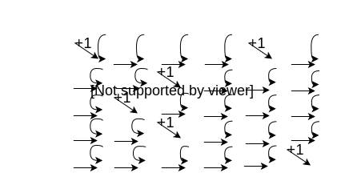

# Dynamic Programming

## An historic note

Developed in the 1940s by Richard Bellman

He chose the name dynamic programming because it sounded cool - it has nothing to do with how it works!

The term programming has nothing to do with writing computer code! It indicates that a table/matrix is used to find a sequence of steps that will produce an optimal solution. The term was popular in military circles back then

DP is typically applied to optimization problems where it would be too computationally expensive to use a similar technique

In order to use DP, the problem has 4 steps:

1. Ensure the problem meets the requirements of a DP solution
2. Devise a recursive solution that can compute an optimal solution
3. Compute the value of the optimal solution bottom up
4. Derive an optimal solution from the results computed in step 3

When we only care about the solution's value rather than the solution, we can skip this step

Like greedy algorithms, a DP algorithm makes its decisions locally - i.e. made based on the information available at the time the decision is made [for a problem that satisfies the DP requirements, we'll be guaranteed that decision will be globally optimal]

Dynamic programming can make tractable the recursive family of algorithms

In order for there to be a dynamic programming solution to a problem, the problem must have

* Optimal substructures
* Overlapping subproblems

## The Key to DP

Save (Enough of) the decision tree to compute successively needed results

## Fibonacci sequence

Recall: 0 1 1 2 3 5 8 13 …
We can define this function by a recursive relationship:

```c++
fib(n) = [ 0, n == 0
         [ 1, n == 1
         [ fib(n-2)+fib(n-1), otherwise
```

Translated to code:

```c++
unsigned long int fib(unsigned long int n){
    if(n == 0) return 0;
    if(n == 1) return 1;
    return fib(n - 2ul) + fib(n - 1ul);
}
```

Alas, this code has O(2<sup>n</sup>) runtime complexity

Using DP to compute fib(n)

Idea: cache previously computed values so we can look them up rather than recompute them

We'll use an array with n slots:

```c++
unsigned long int fib(unsigned long int n){
    int n1 = n + 1;
    unsigned long int f[n1];
    f[0] = 0;
    if(n > 0) f[1] = 1;
    for(unsigned long int i = 2ul; i != n1; ++i){
        fib[i] = fib[i - 2ul] + fib[i - 1ul];
    Return f[n];
}
```

This DP solution's runtime complexity is θ(n)

There is another DP solution with the same runtime complexity and spatial complexity of θ(1). Strictly speaking, we don't need the array for this particular problem, all we really need are two variables to hold the two most recently computed fib() values. An exercise for the diligent student, devise that algorithm

## Longest common subsequence

We have two strings; we want to find the longest run of characters that is common to both strings

The characters do not have to be adjacent, merely have the same relative order: qaqbcy and axbxc would have a longest common subsequence of abc

Recursive relationship (expressed as code)

```c++
if(str1[i] == str2[j])
    T[i][j] = T[i-1][j-1] + 1;
else
    T[i][j] = max(T[i-1][j], T[i][j-1]);
```


